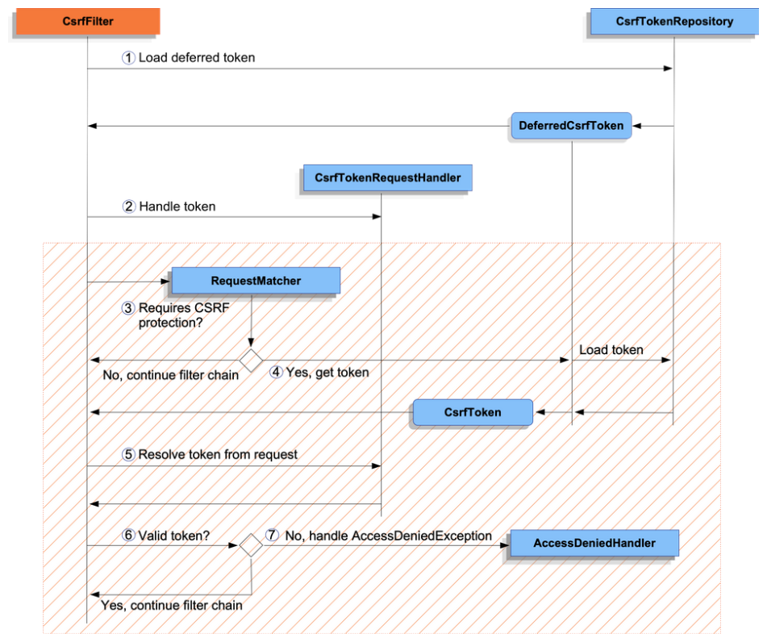

  

Protects against CSRF attacks by default for unsafe HTTP methods,  so no additional code is necessary.
```java
@Configuration
@EnableWebSecurity
public class SecurityConfig {

	@Bean
	public SecurityFilterChain securityFilterChain(HttpSecurity http) throws Exception {
		http
			// ...
			.csrf(Customizer.withDefaults());
		return http.build();
	}
}
```


## `CsrfTokenRepository`
- `HttpSessionCsrfTokenRepository` Stored in: `HttpSession` --> Used by Default
  - reads the token from:
    - HTTP request header named **X-CSRF-TOKEN**
    - or
    - HTTP request parameter named **_csrf**
- `CookieCsrfTokenRepository` Used for _support a JavaScript-based application_
  - writes to a cookie named **XSRF-TOKEN**
  - reads the token from:
    - HTTP request header named **X-XSRF-TOKEN**
    - or
    - HTTP request parameter named **_csrf**
- `YourCustomCsrfTokenRepository` --> You can Impl your own

## Integrating with CSRF Protection
1. include the CSRF token in HTTP Request
  - A form parameter
  - A request header
  - any other which is not automatically included by the browser

### HTML Forms
```html
<input type="hidden"
	name="_csrf"
	value="4bfd1575-3ad1-4d21-96c7-4ef2d9f86721"/>
```
Automatically included:
- ThymeLeaf
- Spring's tag library
- Any other view technology that integrates with `RequestDataValueProcessor` (via `CsrfRequestDataValueProcessor`)  

#### Important: TAke advantage of the `HttpServletResponse` 

`CsrfToken` is exposed in `HttpServletRequest` in the attribute named `_csrf`   

`JSP`
```jsp
<c:url var="logoutUrl" value="/logout"/>
<form action="${logoutUrl}"
	method="post">
<input type="submit"
	value="Log out" />
<input type="hidden"
	name="${_csrf.parameterName}"
	value="${_csrf.token}"/>
</form>
```

## JavaScript Applications
Typically use `JSON` instead of `HTML` then submit the `CSRF` 
within an HTTP request **header** instead of ~~a request **parameter**.~~  

- Did you know ?: Angular can automatically include the actual `CSRF` token as an HTTP request header.

### Single Page Applications (React.js, Angular, Vue.js, Svelte, etc.)
When storing the expected `CSRF` token in a **cookie** JS applications will only have
- access to the plain token value // `console.log(getCookie('XSRF-TOKEN'))`
- won't have access to the encoded value.  

Cookie storing the `CSRF` will be cleared upon:
- Authentication Success
- Logout Success
Spring Security defers loading a new CSRF token by default
- additionally work is required to return a fresh cookie.   


_Configure CSRF for Single-Page Application_
```java
@Configuration
@EnableWebSecurity
public class SecurityConfig {

	@Bean
	public SecurityFilterChain securityFilterChain(HttpSecurity http) throws Exception {
		http
			// ...
			.csrf((csrf) -> csrf
				.csrfTokenRepository(CookieCsrfTokenRepository.withHttpOnlyFalse()) // cookie(csrf) can be read by the JavaScript application
				.csrfTokenRequestHandler(new SpaCsrfTokenRequestHandler()) //  resolves the CSRF token based on whether it is ( HTTP request header (X-XSRF-TOKEN) || request parameter (_csrf) )
			)
			.addFilterAfter(new CsrfCookieFilter(), BasicAuthenticationFilter.class); //  load the CsrfToken on every request, which will return a new cookie if needed.
		return http.build();
	}
}

final class SpaCsrfTokenRequestHandler extends CsrfTokenRequestAttributeHandler {
	private final CsrfTokenRequestHandler delegate = new XorCsrfTokenRequestAttributeHandler();

	@Override
	public void handle(HttpServletRequest request, HttpServletResponse response, Supplier<CsrfToken> csrfToken) {
		/*
		 * Always use XorCsrfTokenRequestAttributeHandler to provide BREACH protection of
		 * the CsrfToken when it is rendered in the response body.
		 */
		this.delegate.handle(request, response, csrfToken);
	}

	@Override
	public String resolveCsrfTokenValue(HttpServletRequest request, CsrfToken csrfToken) {
		/*
		 * If the request contains a request header, use CsrfTokenRequestAttributeHandler
		 * to resolve the CsrfToken. This applies when a single-page application includes
		 * the header value automatically, which was obtained via a cookie containing the
		 * raw CsrfToken.
		 */
		if (StringUtils.hasText(request.getHeader(csrfToken.getHeaderName()))) {
			return super.resolveCsrfTokenValue(request, csrfToken);
		}
		/*
		 * In all other cases (e.g. if the request contains a request parameter), use
		 * XorCsrfTokenRequestAttributeHandler to resolve the CsrfToken. This applies
		 * when a server-side rendered form includes the _csrf request parameter as a
		 * hidden input.
		 */
		return this.delegate.resolveCsrfTokenValue(request, csrfToken);
	}
}

final class CsrfCookieFilter extends OncePerRequestFilter {

	@Override
	protected void doFilterInternal(HttpServletRequest request, HttpServletResponse response, FilterChain filterChain)
			throws ServletException, IOException {
		CsrfToken csrfToken = (CsrfToken) request.getAttribute("_csrf");
		// Render the token value to a cookie by causing the deferred token to be loaded
		csrfToken.getToken();

		filterChain.doFilter(request, response);
	}
}
```

### Multi-Page Applications( where JavaScript is loaded on each page || JQUERY )
an alternative to ~~exposing the CSRF token in a cookie~~ is to include the `CSRF` token within your meta tags  

_CSRF Token in HTML Meta Tag_
```html
<html>
<head>
	<meta name="_csrf" content="4bfd1575-3ad1-4d21-96c7-4ef2d9f86721"/>
	<meta name="_csrf_header" content="X-CSRF-TOKEN"/>
	<!-- ... -->
</head>
<!-- ... -->
</html>
```
JavaScript code can read the meta tags and include the CSRF token as a header, using JQuery:   

_Include CSRF Token in AJAX Request_
```javascript
$(function () {
	var token = $("meta[name='_csrf']").attr("content");
	var header = $("meta[name='_csrf_header']").attr("content");
	$(document).ajaxSend(function(e, xhr, options) {
		xhr.setRequestHeader(header, token);
	});
});
```

### Other JavaScript Applications
Another option for JavaScript applications is:
- to include the `CSRF` token in an HTTP response header.  
through the use of a `@ControllerAdvice` with `CsrfTokenArgumentResolver`  

```java
@ControllerAdvice
public class CsrfControllerAdvice {

	@ModelAttribute
	public void getCsrfToken(HttpServletResponse response, CsrfToken csrfToken) {
		response.setHeader(csrfToken.getHeaderName(), csrfToken.getToken());
	}

}
```
see more at [docs](https://docs.spring.io/spring-security/reference/servlet/exploits/csrf.html#csrf-integration-javascript-other)

## Mobile Applications
typically use JSON instead of HTML (like JS applications).  
A backend application that does not serve **browser traffic** may choose to disable CSRF  
  
However, a backend application that also serves browser traffic and therefore still requires CSRF protection may continue to store the `CsrfToken` in the session instead of in a cookie.  

see more at [docs](https://docs.spring.io/spring-security/reference/servlet/exploits/csrf.html#csrf-integration-mobile)

# Handle `AccessDeniedException`  
To handle an `AccessDeniedException` such as `InvalidCsrfTokenException`  
simply configure the access denied exception:  
```java
@Configuration
@EnableWebSecurity
public class SecurityConfig {

	@Bean
	public SecurityFilterChain securityFilterChain(HttpSecurity http) throws Exception {
		http
			// ...
			.exceptionHandling((exceptionHandling) -> exceptionHandling
				.accessDeniedPage("/access-denied")
			);
		return http.build();
	}
}
```


# CSRF Testing

test CSRF protection using Spring Security’s testing support and CsrfRequestPostProcessor
```java
import static org.springframework.security.test.web.servlet.request.SecurityMockMvcRequestPostProcessors.*;
import static org.springframework.security.test.web.servlet.setup.SecurityMockMvcConfigurers.*;
import static org.springframework.test.web.servlet.request.MockMvcRequestBuilders.*;
import static org.springframework.test.web.servlet.result.MockMvcResultMatchers.*;

@ExtendWith(SpringExtension.class)
@ContextConfiguration(classes = SecurityConfig.class)
@WebAppConfiguration
public class CsrfTests {

	private MockMvc mockMvc;

	@BeforeEach
	public void setUp(WebApplicationContext applicationContext) {
		this.mockMvc = MockMvcBuilders.webAppContextSetup(applicationContext)
			.apply(springSecurity())
			.build();
	}

	@Test
	public void loginWhenValidCsrfTokenThenSuccess() throws Exception {
		this.mockMvc.perform(post("/login").with(csrf())
				.accept(MediaType.TEXT_HTML)
				.param("username", "user")
				.param("password", "password"))
			.andExpect(status().is3xxRedirection())
			.andExpect(header().string(HttpHeaders.LOCATION, "/"));
	}

	@Test
	public void loginWhenInvalidCsrfTokenThenForbidden() throws Exception {
		this.mockMvc.perform(post("/login").with(csrf().useInvalidToken())
				.accept(MediaType.TEXT_HTML)
				.param("username", "user")
				.param("password", "password"))
			.andExpect(status().isForbidden());
	}

	@Test
	public void loginWhenMissingCsrfTokenThenForbidden() throws Exception {
		this.mockMvc.perform(post("/login")
				.accept(MediaType.TEXT_HTML)
				.param("username", "user")
				.param("password", "password"))
			.andExpect(status().isForbidden());
	}

	@Test
	@WithMockUser
	public void logoutWhenValidCsrfTokenThenSuccess() throws Exception {
		this.mockMvc.perform(post("/logout").with(csrf())
				.accept(MediaType.TEXT_HTML))
			.andExpect(status().is3xxRedirection())
			.andExpect(header().string(HttpHeaders.LOCATION, "/login?logout"));
	}
}
```

# Disable CSRF Protection
- By default, CSRF protection is enabled
  - affects integrating with the backend and testing your application  

only certain endpoints do not require CSRF protection and configure an ignoring rule:  
```java
@Configuration
@EnableWebSecurity
public class SecurityConfig {

    @Bean
    public SecurityFilterChain securityFilterChain(HttpSecurity http) throws Exception {
        http
            // ...
            .csrf((csrf) -> csrf
                .ignoringRequestMatchers("/api/*")
            );
        return http.build();
    }
}
```
or disable entire CSRF protection 
```java
@Configuration
@EnableWebSecurity
public class SecurityConfig {

	@Bean
	public SecurityFilterChain securityFilterChain(HttpSecurity http) throws Exception {
		http
			// ...
			.csrf((csrf) -> csrf.disable());
		return http.build();
	}
}
```

# CSRF Considerations 
## Logging In
Protecting against forging login requests

     1. A malicious user performs a CSRF login with the malicious user’s credentials. 
        The victim is now authenticated as the malicious user.

     2. The malicious user then tricks the victim into visiting the compromised website and entering sensitive information.

     3. The information is associated to the malicious user’s account so the malicious user can log in with their own credentials and view the victim’s sensitive information.

A possible complication:  
user might experience a session timeout that causes the request to be rejected. A session timeout is surprising to users who do not expect to need to have a session to log in. For more information refer to CSRF and Session Timeouts.

## Logging Out
. Protecting against forging logout requests.  

A possible complication:    
user might experience a session timeout that causes the request to be rejected. A session timeout is surprising to users who do not expect to have a session to log out. For more information, see CSRF and Session Timeouts.

## CSRF and Session Timeouts
More often than not, the expected CSRF token is stored in the session.  
- as soon as the session expires, the server does not find an expected CSRF token and rejects the HTTP request.  

### Options to solve timeouts ( each of which come with trade offs):  
1. best way: use JS to request a `CSRF` on form submission.  
   - The form is then updated with the CSRF token and submitted.    

2. Have some JS that lets the user know their session is about expire.  
   - user can click a button to continue & refresh the session  

3. finally: expected CSRF token could be stored in a cookie.
   - lets the expected `CSRF` token outlive the session  

- Why the expected `CSRF` token is not stored in a cookie by default?  
  - exploits in header, which can be set by another domain
    - e.g. To specify the cookies 
  - removing the state you cannot forcibly invalidate a token if is compromised.

## Multipart ( file upload)
see more at [docs](https://docs.spring.io/spring-security/reference/features/exploits/csrf.html#csrf-considerations-multipart)
